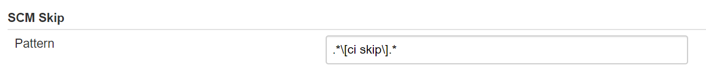
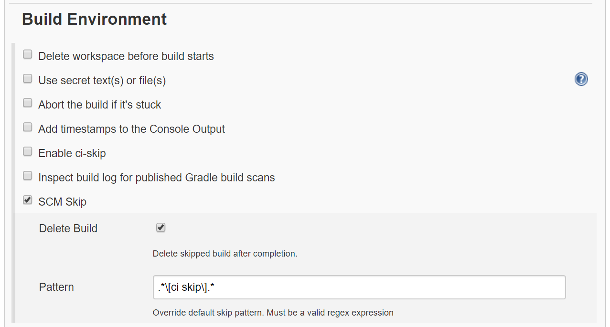

# Jenkins SCM Skip Plugin

SCM Skip Plugin skips build triggered by SCM webhooks based on the commit message. If commit message matches given regular expression freestyle or pipeline build is skipped. Default regex is `.*\[ci skip\].*`, but can be overridden in global Jenkins configuration or on specific job/pipeline.

The plugin enables deletion of skipped builds. This feature is available for freestyle jobs and also for pipelines.

## How it works

After SCM checkout SCM Skip plugin matches all commit messages with regular expression. For freestyle jobs, the plugin integrates early into lifecycle after SCM checkout. Therefore, nothing is executed on a positive regex match. 

For pipeline jobs, the plugin can be enabled as a pipeline step and currently cannot be executed earlier in the Jenkins build lifecycle.

If all the commit message matches the pattern, the build is aborted (and deleted if enabled). For example, one of the matching messages would be:
- `Updated version. New version: 1.0.1 [ci skip]`
- `[ci skip] Some changes`
- `[ci skip]`


Example of non skipped build. In this case one of the checkins is not
meant to be skipped, so the build is not aborted:
- `Updated version. New version: 1.0.1 [ci skip]`
- `BUG-135 Some changes`
- `[ci skip]`

## Global Configuration

The regular expression can be set in Jenkins global configuration under "SCM Skip" section.



## Enable on: freestyle job

On a freestyle job, the plugin can be enabled under the ***Environment*** section. Among other options, there is also a checkbox for "SCM Skip". After enabling plugin there are also options to override matching regex and enable deletion of skipped build.  A sample configuration is depicted on an image below.



## Enable on: pipeline

When using pipeline with a Jenkinsfile syntax (declarative or scripted), the plugin can be enabled as a step in a stage with ***scmSkip*** step. The plugin can be included anywhere in pipeline, but it is recommended to include it as the first step. This way no other steps will be executed if the build is skipped. How to include the plugin in the pipeline is depicted on the image below. In the pipeline is also possible to override the regex pattern and enable build deletion. Both parameters are optional.

```Jenkinsfile
    pipeline {
        agent any
        
        stages {
            stage('Checkout') {
                steps {
                    scmSkip(deleteBuild: true, skipPattern:'.*\\[ci skip\\].*')
                }
            }
        }
    }
```
*When overriding the skip pattern in pipeline descriptor, make sure special characters are properly escaped (e.g. "\\").*

## Release notes

- ### 1.0.3
    Resolved issue. Skip pattern matcher didn't match multiple lines in the commit message. 
    Jira ticket: https://issues.jenkins-ci.org/browse/JENKINS-62751

- ### 1.0.2
    Resolved issue. Build number was not preserved on multibranch pipelines when build deletion enabled.
    Jira ticket: https://issues.jenkins-ci.org/browse/JENKINS-61113

- ### 1.0.1
    Resolved issue. Skip pattern defined in Jenkinsfile wasn't overriding global configuration.
    Jira ticket: https://issues.jenkins-ci.org/browse/JENKINS-57234
- ### 1.0.0 
    Initial release
